# PPSSolver Validation Report

This document provides a comprehensive validation report for the PPSSolver application (Version 1.0) across four modules (Instance Generation, Optimization, Dynamic Handling, and Results Analysis), detailing the testing procedures, results, and conclusions drawn from the validation process.

All tests were conducted on a Windows 11 system with a 12th Gen Intel(R) Core(TM) i7-12700T (1.40 GHz) CPU and 32 GB RAM using Python 3.9, Gurobi 11.0.3, and relevant packages listed in requirements.txt.

## 1. Test procedure
### 1.1. Instance Generation 
- **Objective**: Verify that the instance generation module creates valid PPSSP instances based on user-defined parameters.

- **Steps**:
  1. Launch PPSSolver (either via Gui.py or PPSSolver.exe).
  2. Open Paths Configuration and set:
     - Instances Path: C:\PPSSP\instance
     - Results Path: C:\PPSSP\result
  3. Navigate to the Instance Generation page.
  4. Enter:
     - Instance Index: 1
     - Number of Projects: 1000
     - Planning Years: 25
     - Initial Budget Proportion: 0.25
     - Discount Rate: 0.01
  5. Click Generate Instance.
  6. Repeat the generation process multiple times with different parameters to ensure robustness.

- **Expected Outcome**: Files named `PI_1_1000_25_0.25_0.01.pkl` and `PI_1_1000_25_0.25_0.01.dat` were created in the specified instances path, containing a valid PPSSP instance.

### 1.2. Instance Optimization
- **Objective**: 
  1. Validate that the optimization module correctly utilizes different solvers (Gurobi, GA, DE, BRKGA, HEGCL) to solve PPSSP instances and saves results appropriately.
  2. Validate that multiple instances can be optimized in a single run.
  3. Validate that Pause, Continue, and Stop buttons function as intended during optimization.

- **Steps**:
  1. Navigate to the Instance Optimization page. 
  2. Select a instance PI_1_1000_25_0.25_0.01.pkl or multiple instances.
  3. Choose solver Gurobi, GA, DE, BRKGA, Gurobi or HEGCL. 
  4. Configure solver parameters by clicking Load Default Parameters or manually setting:
     - For Gurobi:
       - Time Limit: 600 seconds 
       - MIP Gap: 0.01 
     - For Metaheuristic Solvers (GA, DE, BRKGA, HEGCL):
       - Runs: 1 or 2
       - Population Size: 100
       - Result Display Frequency: 100 or 200
       - Algorithm-specific parameters as needed.
  5. Click Run Solver.
  6. During optimization, test Pause, Continue, and Stop buttons to ensure they function correctly.

- **Expected Results**
  - if Gurobi is selected:
    - Solver output log shows optimal fitness value and time.
    - Result files (the generated portfolio .pkl and solving log .log) saved in C:\PPSSP\results\PI_1_1000_25_0.25_0.01\Gurobi_600_0.01\.
  - if Metaheuristic solver is selected:
    - Solver output log shows real-time values of n_gen, n_eval, f_best, and f_avg.
    - Final results saved correctly.
    - Convergence data saved in CSV format.
    

### 1.3. Dynamic Handling
- **Objective**: Ensure that the dynamic handling module effectively manages changes in project parameters and successfully re-optimizes modified instances.
- **Steps**
  1. Open Dynamic Instance Optimization. 
  2. Select the previously optimized instance `PI_1_1000_25_0.25_0.01.pkl`. 
  3. Select the corresponding optimized portfolio file.
  4. Set:
     - Current Year: 4
     - New Budget: 0.8 
     - Removed Projects: 1, 10
  5. Choose solver GA or HEGCL and click Re-optimize.

- **Expected Results**
    - Real-time log shows updated optimization progress.
    - Results saved in the appropriate results folder.
  

### 1.4. Results Analysis
- **Objective**: Confirm that the results analysis module accurately evaluates and compares optimization outcomes across different algorithms.
- **Steps**
  1. Open Results Analysis page. 
  2. Select analysis type from Compare Portfolio Values and Runtimes, Visualize Convergence Graphs, and Analyze Optimized Portfolio.
  3. Choose algorithms Gurobi, GA, DE, BRKGA and HEGCL
  4. Select instance PI_1_1000_25_0.25_0.01.pkl
  4. Click Analyze Results.

- **Expected Results**
  - if anlysis type is Compare Portfolio Values and Runtimes:
    - A table displaying mean values and mean runtimes for each algorithm.
  - if analysis type is Visualize Convergence Graphs:
    - A plot showing convergence curves for selected algorithms.
  - if analysis type is Analyze Optimized Portfolio:
    - Detailed charts for the solution obtained by each of the selected algorithms saved to the specified path.
  

## 2. Test Results 
### 2.1. Instance Generation
- **Actual Outcome**: 
  - Real-time log (displayed in Instance Generation Output) indicates successful instance generation.
  - Instance files were successfully created and saved at C:\PPSSP\instance.
   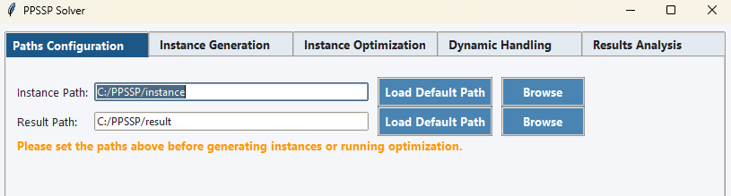
   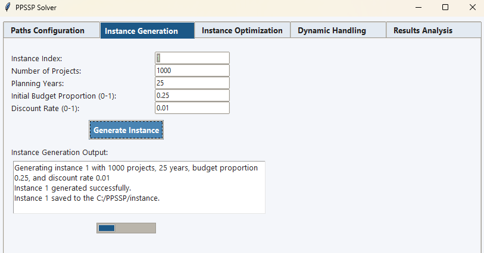
  - More instances were generated with varying parameters (Number of Projects from 1000 to 5000), all saved correctly.
   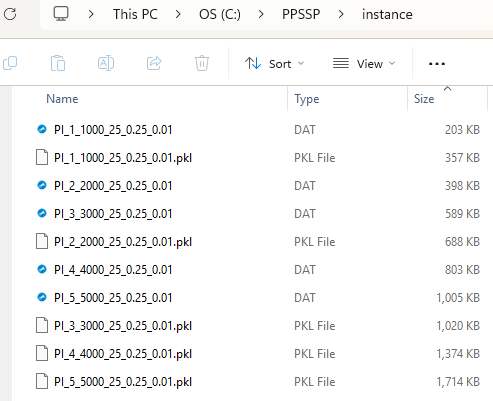
- **Conclusion**: The instance generation module functions correctly, producing valid PPSSP instances based on user-defined parameters.

### 2.2. Instance Optimization
- **Actual Results**
  - For Gurobi:
    - Solver output log indicates successful optimization.
    - Result files were saved in the specified directory.
    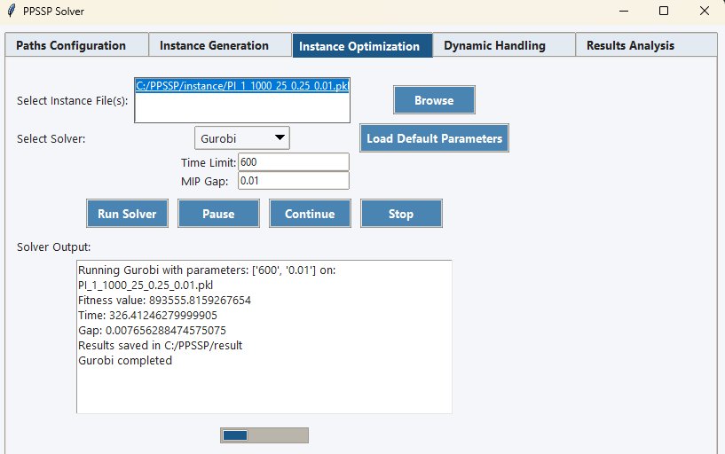
  - For Metaheuristic Solvers (GA, DE, BRKGA, HEGCL):
    - Real-time logs displayed n_gen, n_eval, f_best, and f_avg as expected.
    - Final results were saved correctly in the results directory.
    - Convergence data was successfully exported in CSV format.
      - GA:
      
    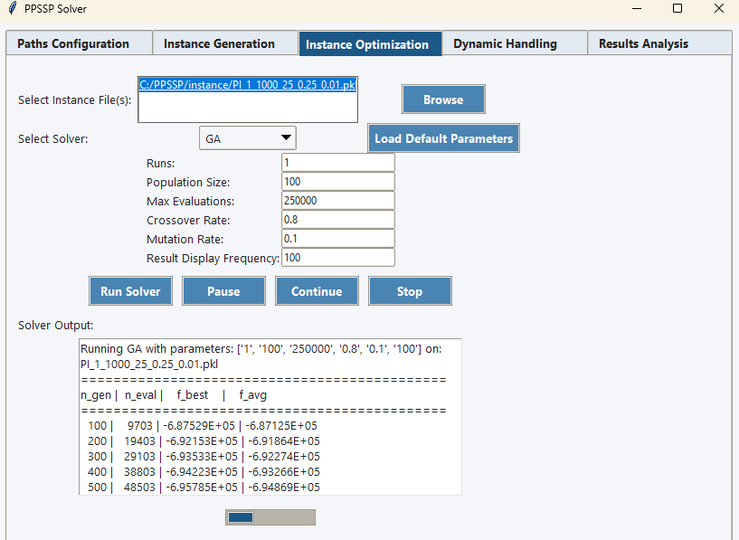
    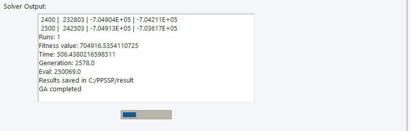
      - DE:
    
    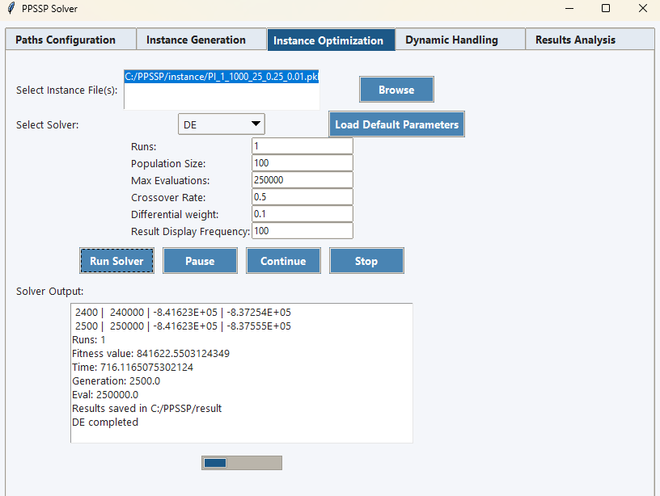  
    - BRKGA where we adjusted the Result Display Rrequency to 200:
    
    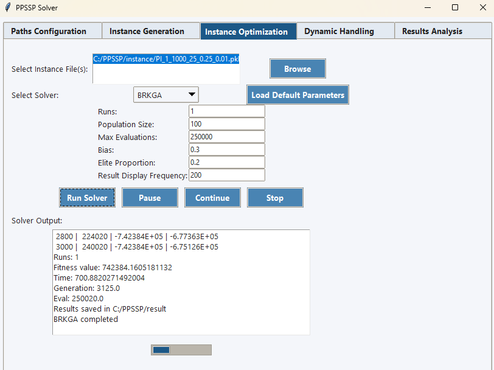
    - HEGCL
    
    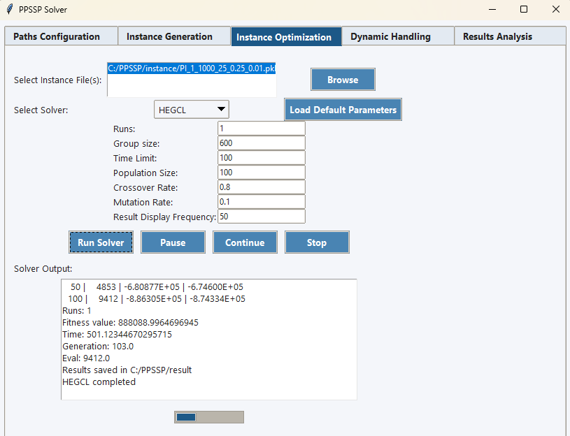
  - Multiple instances were optimized in a single run successfully.
  
    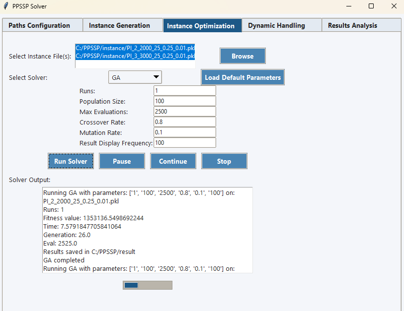
  - During optimization, Pause, Continue, and Stop buttons functioned as intended.
    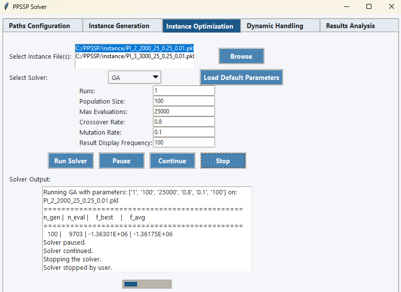
- **Conclusion**: The optimization module operates as intended. 

### 2.3. Dynamic Handling
- **Actual Results**
  - Real-time log displayed updated optimization progress as expected.
  - Results were successfully saved in the designated results folder.
    - Gurobi:
    
    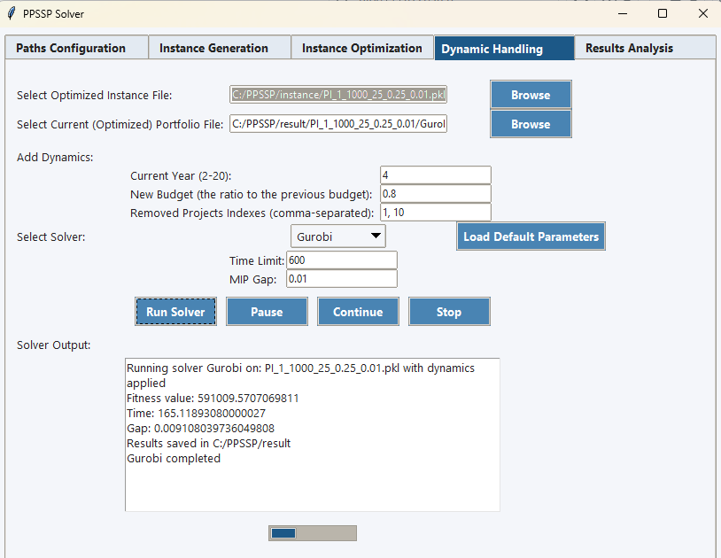
    - GA:
    
    
    - HEGCL:
  
    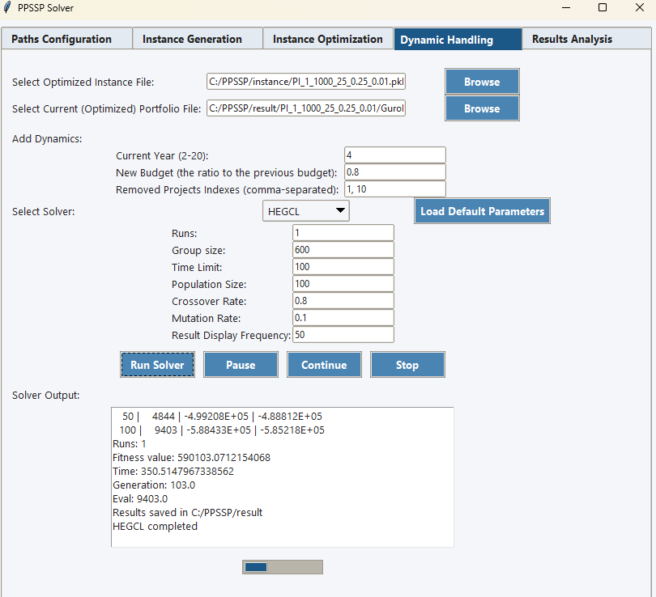
- **Conclusion**: The dynamic handling module effectively manages changes in project parameters and successfully re-optimizes the modified instances.

### 2.4. Results Analysis
- **Actual Results**
  - For Compare Portfolio Values and Runtimes:
    - A table displaying mean values and mean runtimes for each algorithm was generated as expected.
   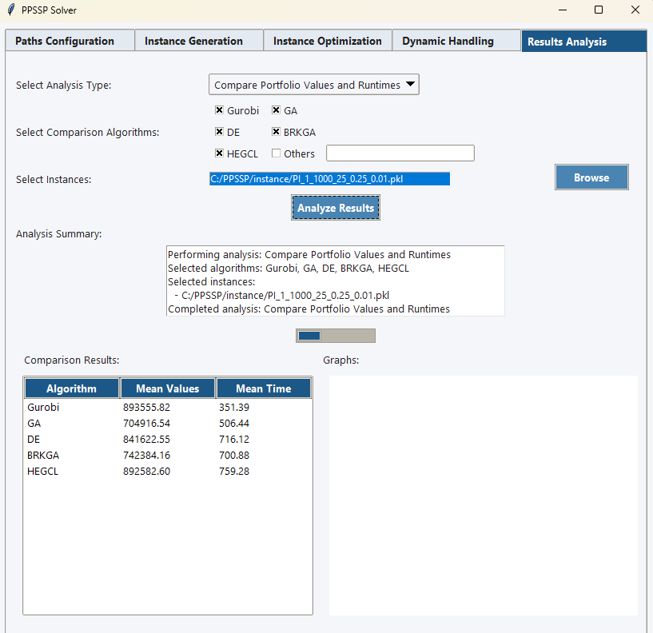
  - For Visualize Convergence Graphs:
    - A plot showing convergence curves for selected algorithms was created successfully.
   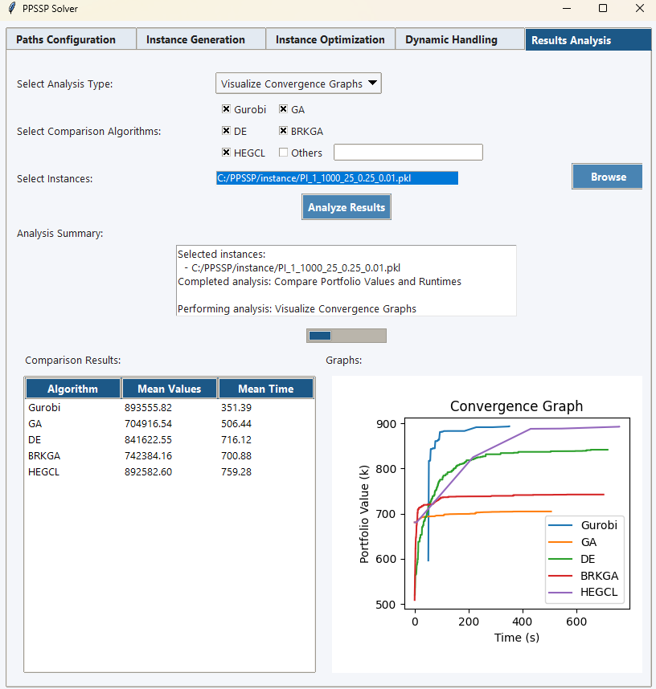
  - For Analyze Optimized Portfolio:
    - Detailed charts for the solution obtained by each of the selected algorithms were generated and saved correctly.
   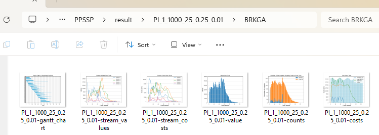
   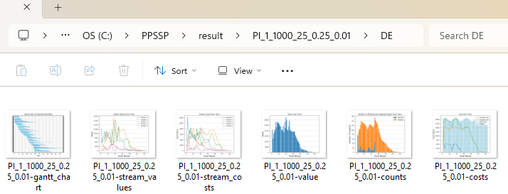
- **Conclusion**: The results analysis module accurately evaluates and compares optimization outcomes across different algorithms.

## 3. Abnormal Cases
- If the user attempts to generate an instance or optimize without setting valid paths in the Paths Configuration, the application correctly displays an error message in an error box, preventing further execution until valid paths are provided.
  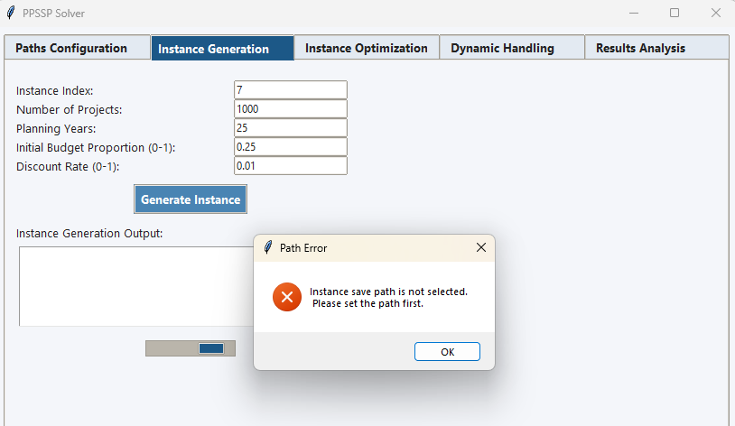
- When Gurobi was not installed properly or the license was invalid. The application correctly displayed an error message in the solver output log and an error box, preventing further execution. This behavior is appropriate as it informs the user of the issue without causing a crash.
  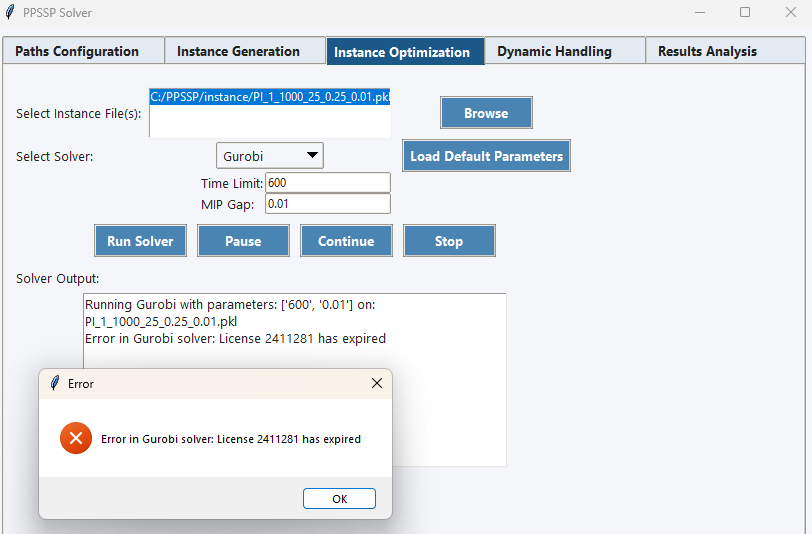
- When parameters were missing or invalid parameters were entered (e.g., negative values for budget proportion or discount rate), the application displayed appropriate error messages in an error box, preventing further execution until valid parameters were provided.
  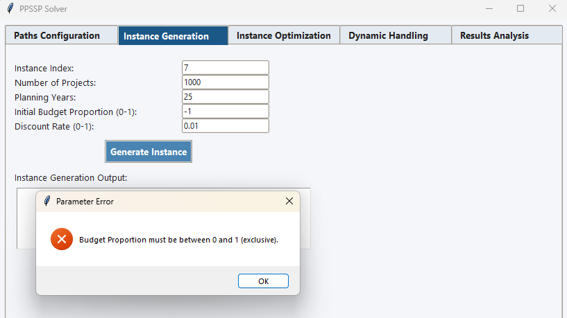
  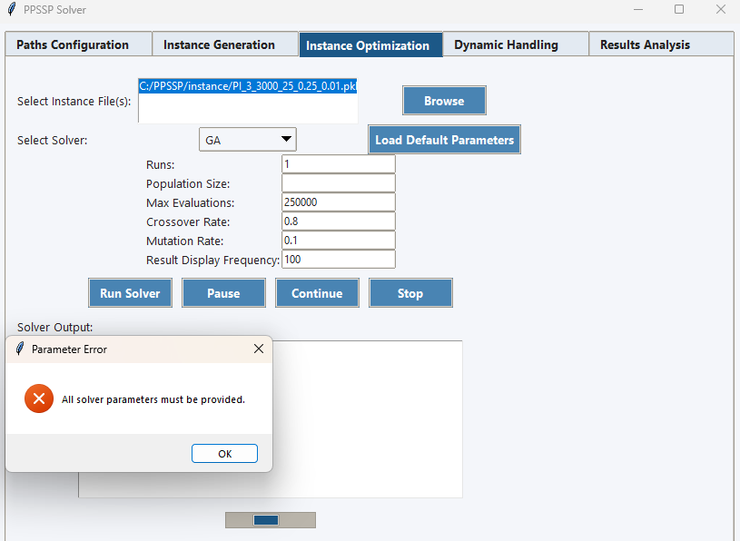

## 4. Overall Conclusion
The PPSSolver application (Version 1.0) has been thoroughly validated across all four modules: Instance Generation, Optimization, Dynamic Handling, and Results Analysis. Each module performed as expected, successfully generating instances, optimizing them using various algorithms, handling dynamic changes, and analyzing results accurately. The application is deemed reliable and effective for solving the Project Portfolio Selection and Scheduling Problem (PPSSP).